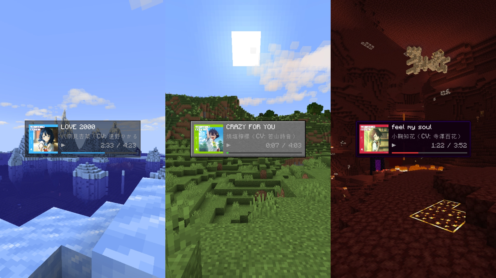
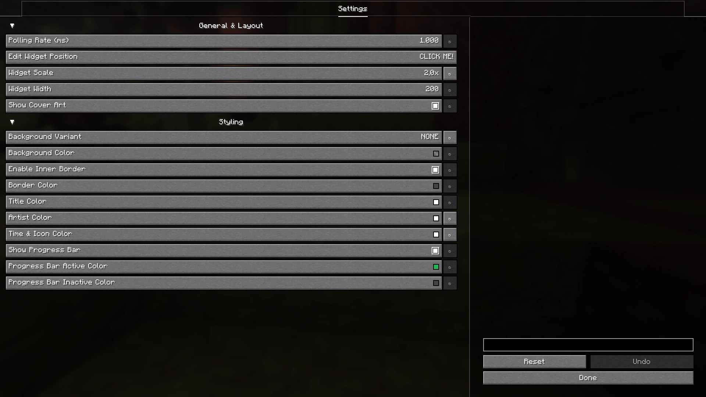
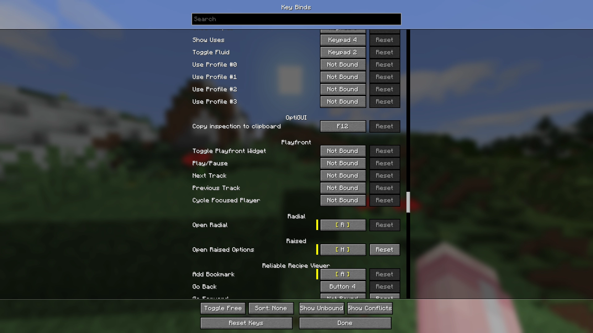

# Playfront

### Your tunes, right on your screen. A lightweight, plug-and-play media overlay for Minecraft.

## Overview
**Playfront** is a client-side utility mod that bridges the gap between Minecraft and your Windows media players. Built for seamless immersion, it eliminates the need to alt-tab by putting your currently playing music, videos, and podcasts in a sleek, dynamic HUD widget that just works.

***Note: Playfront utilizes the Windows SMTC API and is strictly supported on Windows operating systems.***

## Features

### Bring Your Music In-Game

Connects directly to Windows to display live metadata and dynamic album art from Spotify, Chrome, Apple Music, and more. Listening to multiple things? Instantly cycle through your active background media players with a single keypress.

### Complete Visual Control

Make it yours. Adjust the widget position with an interactive editor, change title and artist colors, toggle the progress bar, or switch background variants (from sleek tooltip frames to minimalist transparent designs) to perfectly match your setup.

### Full Playback Control

Bind your media controls directly to Minecraft. Play, pause, skip tracks, go to the previous song, or quickly hide the HUD entirely on the fly without ever minimizing the game or reaching for your media keys.
> **Running out of keys on your keyboard?**  
> If you don't want to dedicate 5 separate keybinds to media controls, I highly recommend pairing Playfront with my other mod, [**Radial**](https://modrinth.com/mod/radial). You can map all your playback commands into a radial menu to save space!

## Version Support & Backports

To keep development focused and maintain a healthy workflow, this mod operates on a **forward-only** development cycle.

- **Active Development:** I am currently only developing and testing for the newest targeted Minecraft version. New features, improvements, and bug fixes will only be applied to this latest version.
- **No Backporting:** I do not backport features or patch bugs for older versions of Minecraft.
- **Older Releases:** Past versions of the mod will remain available to download for players using older modpacks, but they are provided "as-is" and will not receive further updates.
- **Community Contributions:** If you are passionate about a specific older version, feel free to fork the repository and submit a Pull Request! I am more than happy to review and accept community-driven backports, bug fixes, or maintenance updates for older versions.